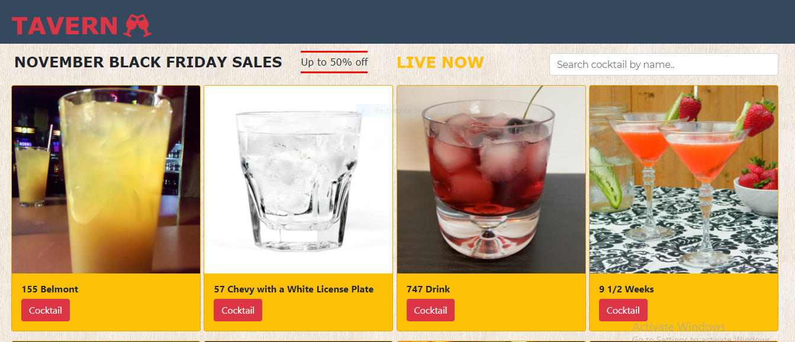

#  Tavern
- It is an online cocktail supply store. It shows a long list of tasty cocktails to view and make orders from. It is a single page application that links to each individual cocktail page to see the price and add to cart.
- Users can filter the displayed cocktails by searching their names. Then directly view each individually.

## Heroku link
[click here](https://mbegerastavern.herokuapp.com/)

## BUILT WITH
- JavaScript
- Node.js
- React
- React-Create-App
- Redux
- ES6
- CSS

## Getting Started

To run this project locally, you must have node and npm installed on your machine.

# Setup
To set up this project on your local machine:

Navigate to the folder where you want the repository to be copied and run 

`git clone https://github.com/Leon-Mbegera/Tavern.git`

Navigate to the directory :

`cd tavern`

To start the server: 

`npm start`

Go to http://localhost:3000/ in your browser to see the application running

# To test the code

 `npm test`
 
 - Enter 'a' to see all tests

## Author

👤 **Leon**

- GitHub: [github](https://github.com/Leon-Mbegera)
- LinkedIn: [LinkedIn](https://www.linkedin.com/in/leon-mbegera)

## 🤝 Contributing

Contributions, issues and feature requests are welcome!

Feel free to check the [issues page](https://github.com/Leon-Mbegera/tarvern/issues/).

## Show your support

Give a ⭐️ if you like this project!
